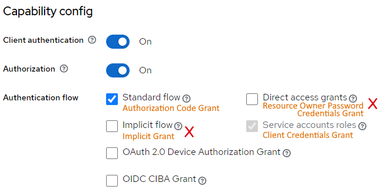
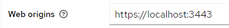
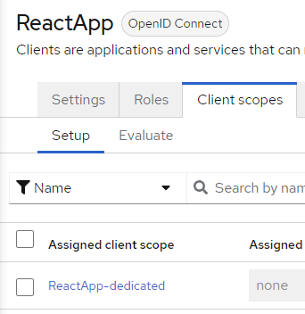
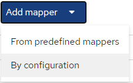
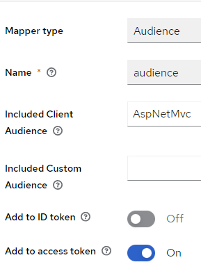

# Clients and authentication options

After creating a realm, a new client must be created in Keycloak for each application that needs to authenticate its users.

Each client can use a different authentication flow, but all clients share the same realm settings and users.

At certain conditions, a token created for a client can be spent in a different client. We will see an example of how this is possible.

## Authentication Flows

Keycloak supports the following authentication flows:

The `Client authentication` check specifies whether the client is confidential (`On`) or public (`Off`).

The `Authorization` check does not impact on the flows.

The `Authentication flow` checks are detailed below.

### Standard flow [oAuth Authorization code grant]

**Scenario**: Server-side applications with UI

* RFC 6749 - 4.1

* response_type=code
* https://www.keycloak.org/docs/latest/server_admin/#_oidc-auth-flows-authorization

**Scenario**: Client-side applications SPA and Mobile applications

* RFC 6749 - 4.1
* PKCE recommended in RFC 7636 - 4.3
* grant_type="password"

### Direct access grants [oAuth Resource Owner Password Credentials Grant']

**Scenario**: Server-side applications with UI

* **Deprecated in oAuth 2.1 draft**
* RFC 6749 - 4.3
* grant_type="password"

### Implicit flow [oAuth Implicit grant]

**Scenario**: Client-side applications SPA

* **Deprecated in oAuth 2.1 draft**
* Uses Form POST
* RFC 6749 - 4.2
* response_type=token

### Service accounts roles [oAuth Client Credentials Grant]

**Scenario**: Web API

* RFC 6749 - 4.4
* grant_type="client_credentials"

A service account on Keycloak is associated with a client and used to obtain a token on behalf of the user requesting the data.

Service accounts are configured in `Clients` $\Rightarrow$ ClientName $\Rightarrow$ `Service account roles` 

This procedure requires:

1. `Client authentication` to `On`
2. `Service account roles` checked
3. `Client scopes` $\Rightarrow$ *ClientName*`-dedicated` $\Rightarrow$ `Scope` to `On`

Link: https://www.keycloak.org/docs/latest/server_admin/#_service_accounts

### OAuth2.0 Device Authorization Grant  [oAuth Device Authorization Grant]

**Scenario**: Client with limited capabilities (no modern browser)

* RFC 8628
* grant_type="urn:ietf:params:oauth:grant-type:device_code"

This requires manual intervention of the user by mean of a mobile application to validate the user code and complete the authentication.

An example is an automatic distributor/dispenser or a basic IoT device.

### OIDC CIBA Grant [OIDC CIBA Grant]

**Scenario**: add-on to standard flow or device grant

* https://openid.net/specs/openid-client-initiated-backchannel-authentication-core-1_0.html
* grant_type="urn:openid:params:grant-type:ciba"

The backchannel can be used in several ways. It substantially allows the relaying party to talk directly with the identity provider using a dedicated channel. This channel can work in several ways (see specs).

In the standard flow, Keycloack can use the backchannel to inform the relaying party to close all the active sessions when the user logs off.

## Cross-client example

In our example we have two clients, "AspNetMvc" and "ReactApp":

The first is a classic ASP.NET Core MVC application which also has a (very basic) API controller returning some json data.

The second is a pure react application which authenticate the user for the front-end (whose claims are defined in the `id_token`), and use the `access_token` to access the AspNetMvc client Web API.

Beyond the OIDC specific code in both applications, this chapter talks about the Keycloak settings that are relevant to allow the react application to access the Web API.

### Settings on AspNetMvc

Since this is a "server app", it is configured with the **standard flow** and **client authentication turned on**. This means that the client secret must be added to the app OIDC configuration.

### Settings on ReactApp

Since this is a SPA, it is important setting up CORS using the "Web origins" url:

>  When debugging, the Web Origin can be set to `*` which allows any origin.

The flow for SPA and Mobile is still **standard flow**. Avoid the `Implicit flow` as  it has been deprecated in oAuth2.1.

The client authentication for this client is Off because SPAs and Mobile apps cannot guarantee to safely store the client credentials.

Since  we want to "spend" the token obtained from "ReactApp" into a "AspNetMvc" WebAPI, we need to add the appropriate **audience** (`aud`) claim. The audience is the claim that states who is this token intended for. This can be done in the `React-App-dedicated` client scopes:

Add a new mapper `By Configuration`:

Select the `Audience` pre-defined claim and fill-in the form:

It is important selecting the `access_token` which is the one used as "Bearer Token" in the Web API. Instead, the "ID token" is the one used to authenticate the user interactively in the front-end of the SPA app.

Lastly, in the WebAPI side, you may have issues with the **issuer** (`iss`) claim  during debugging because of the dns names of your services/apps may not match. In this case you can disable the issuer validation, but remember **not to do that in production**.

